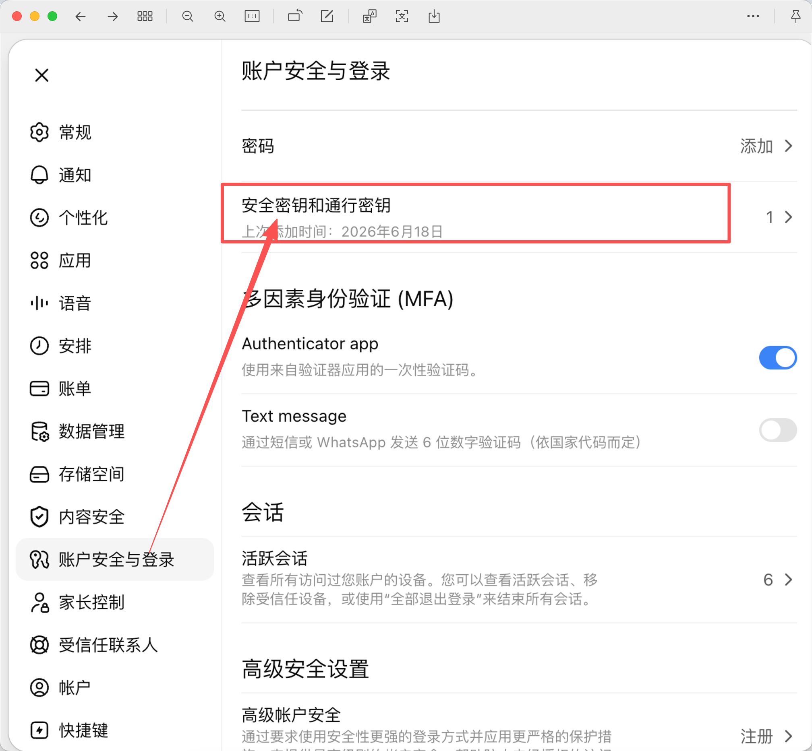
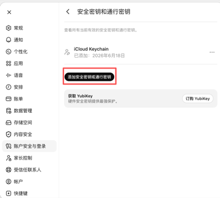
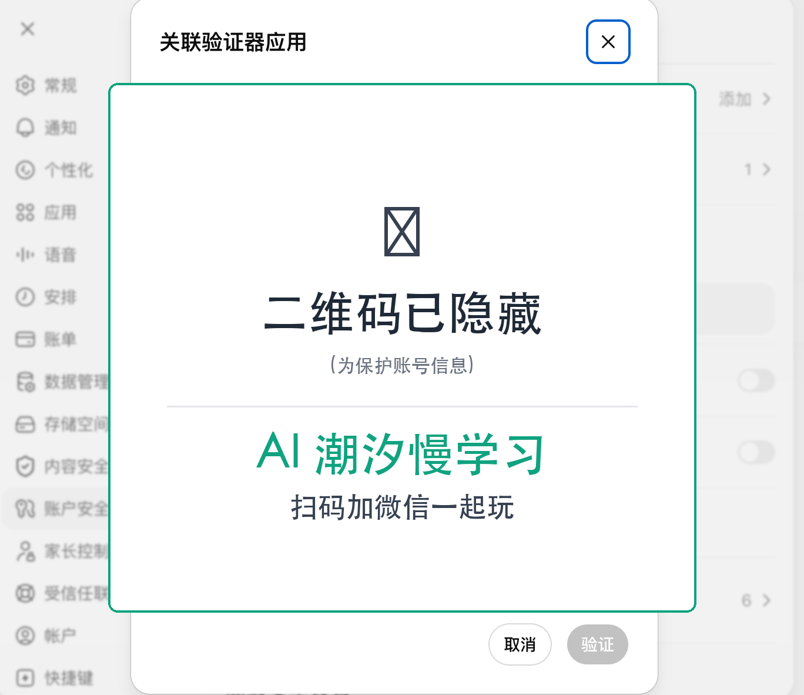
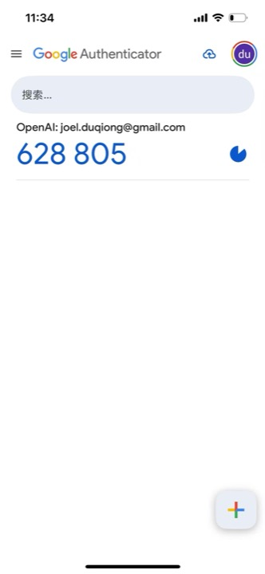

# Codex 登录不上?这个能救你

**没有海外手机号,收不到 Codex 的短信验证码。**

下面 3 个方法,按推荐顺序。前面 2 个正面解决,实在都不行再用第 3 个绕过。

---

## 方法 1:安全密钥 / 通行密钥 ⭐推荐

最干净、一次配永久用、不需要手机。配 YubiKey / Touch ID / Windows Hello / iPhone 都可以。

### 怎么加

1. 打开 [chatgpt.com](https://chatgpt.com),登录
2. 进 **账户安全与登录**
3. 点 **安全密钥和通行密钥**

4. 点 **添加安全密钥或通行密钥**

5. 按提示插入 YubiKey / 用 Touch ID / 用 iPhone / 用 Windows Hello

### 优点

一次配好,以后登录 Codex CLI 系统提示用密钥验证,**不再需要短信**。

### 缺点

要硬件(YubiKey ¥200-500),或用本机的 Touch ID / Windows Hello(免费,但要在登录 Codex 的同一台设备上)。

---

## 方法 2:Authenticator APP(Google / Microsoft)

免费,装个 APP 扫个二维码,以后输入 6 位数。

### 怎么配

1. 手机装一个 Authenticator APP([Google Authenticator](https://play.google.com/store/apps/details?id=com.google.android.apps.authenticator2) / [Microsoft Authenticator](https://www.microsoft.com/security/mobile-authenticator-app))
2. Codex 网页版 → **账户安全与登录** → 打开 **Authenticator app** 开关

3. 弹二维码窗口

4. APP → 点 **+** → 扫这个二维码

5. APP 显示 6 位码,输入到 Codex → 验证

### 优点

免费、主流、不依赖手机信号(APP 离线算 6 位码)。

### 缺点

要装 APP(Google/MS 国内可能需科学上网);换手机要迁移。

---

## 方法 3:绕过登录(本仓库工具) ⚠️ 兜底

跳过 Codex CLI 整个登录流程,直接用 ChatGPT session token 写 `~/.codex/auth.json`。

### 怎么用

1. 浏览器登录 [chatgpt.com](https://chatgpt.com)
2. 新开标签,访问 `https://chatgpt.com/api/auth/session`,`Ctrl+A` 复制返回的 JSON
3. 打开 [**index.html**](./index.html),把 JSON 粘到输入框
4. 选系统(Windows / Linux / macOS),命令自动生成
5. 复制命令,粘到终端回车

或点"AI 一键跑"按钮,生成一段给 AI agent 的指令,让 AI 帮你跑 + 验证。

### 代价

⚠️ **token 约 10 天过期**,过期要重新跑一次。本工具拿不到 refresh_token,不能自动续。

---

## 怎么选

| 情况 | 选 |
|---|---|
| 有 YubiKey 或设备支持 FIDO2 | 方法 1(最稳) |
| 有手机能装 APP | 方法 2(免费) |
| 前两个都不行 / 不想折腾 | 方法 3(10 天重做) |

## 安全(方法 3)

- **100% 本地运行** — token 在浏览器里处理,不会上传到任何服务器
- **可断网验证** — 另存 index.html 断网打开,所有功能照样用
- **代码完全可见** — 没有混淆/加密/外发

## 免责声明

- 方法 1、2 是 OpenAI 官方支持的认证方式
- 方法 3 只读你自己浏览器里 ChatGPT session 的 token,不绕过任何 ChatGPT 安全机制
- 你的 token 自己保管,不要发给任何人,不要截图发群里
- 用 ChatGPT Plus 订阅登录 Codex 需自行确认是否符合 OpenAI 服务条款
- 作者不为使用此工具导致的任何账号问题负责

## 链接

- [Codex CLI 官方认证文档](https://developers.openai.com/codex/auth)
- [openai/codex 源码](https://github.com/openai/codex)
- [Codex CLI 参考](https://developers.openai.com/codex/cli/reference)
